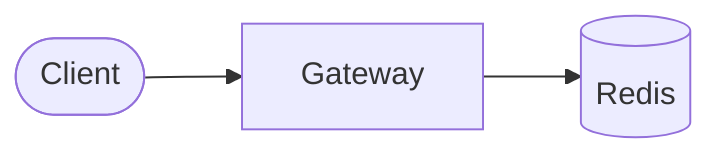
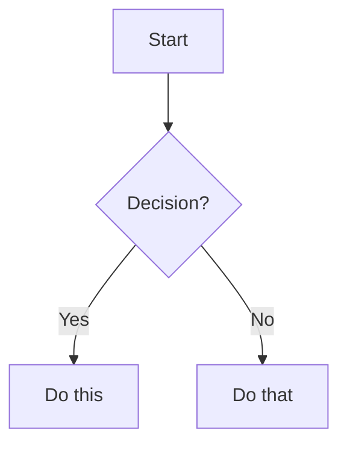
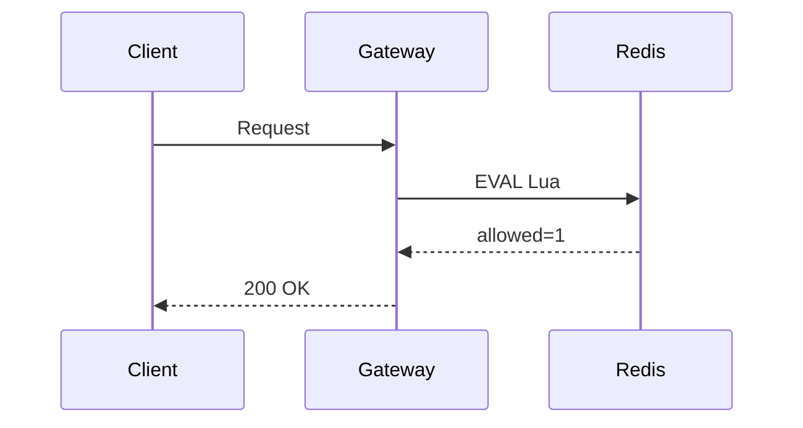
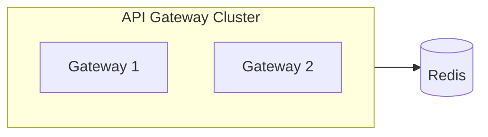

# Blog Writing Guide

## Creating a New Post

Create a new `.mdx` file in this folder (`content/blog/`). The filename becomes the URL slug.

**Example:** `my-new-post.mdx` → `sauravx.com/blog/my-new-post/`

## Frontmatter (Required)

Every post must start with frontmatter:

```yaml
---
title: "Your Post Title"
description: "A short summary for SEO and the blog listing page."
date: "2026-05-07"
tags: ["tag1", "tag2", "tag3"]
---
```

- `title`  Displayed as the page heading and in browser tab
- `description`  Shows on the blog listing page and in Google search results
- `date`  Format: YYYY-MM-DD. Posts are sorted by date (newest first)
- `tags`  Array of strings. Displayed as pills on the post

## Markdown Syntax

### Headings

```markdown
## Section Title (h2)  appears in Table of Contents
### Subsection (h3)  appears indented in TOC
```

Only use `##` and `###`. Don't use `#` (that's the post title).

### Text Formatting

```markdown
**bold text**
*italic text*
`inline code`
[link text](https://example.com)
```

### Code Blocks

````markdown
```java
public class Example {
    public static void main(String[] args) {
        System.out.println("Hello");
    }
}
```
````

Supported languages: `java`, `javascript`, `python`, `sql`, `lua`, `json`, `yaml`, `bash`, `html`, `css`, `typescript`, etc.

### Lists

```markdown
- Bullet point
- Another point
  - Nested point

1. Numbered item
2. Second item
```

### Blockquotes

```markdown
> This is a blockquote. Use it for callouts or quotes.
```

### Horizontal Rule

```markdown
---
```

## Images

Place images in the `public/blog/` folder, then reference them:

```markdown

```

**File structure:**
```
public/
└── blog/
    ├── architecture-diagram.png
    └── redis-flow.png
```

**SEO tips:**
- Use **descriptive alt text** — 10–20 words explaining what the diagram shows. This is what Google indexes.
- Name files using the search query you want to rank for, e.g. `redis-cluster-hash-slots-diagram.png` not `img1.png`
- Use hyphens, not spaces in filenames
- Supported formats: PNG, JPG, WebP, SVG, GIF
- Images are automatically wrapped in `<figure><figcaption>` — the alt text becomes the visible caption
- A fullscreen expand button appears automatically on each image — no extra work needed

---

## Mermaid Diagrams

Write architecture and flow diagrams directly in the post using Mermaid syntax. They render as interactive SVG in the browser with a fullscreen expand button.

````markdown

````

### Diagram Types

**Flowchart (most common):**

````markdown

````

**Sequence diagram:**

````markdown

````

### Node Shapes

```
[Rectangle]        — process / component
([Rounded])        — start / end / client
{Diamond}          — decision
[(Cylinder)]       — database / Redis
((Circle))         — connector dot
```

### Colors (semantic conventions used in this blog)

Apply colors with `style` declarations at the bottom of the diagram:

```mermaid
flowchart LR
    GW[Gateway]
    RD[(Redis)]
    ERR[Error]

    style GW  fill:#1e3a5f,stroke:#3b82f6,color:#bfdbfe   %%  blue  — gateway/service
    style RD  fill:#1a2e1a,stroke:#22c55e,color:#bbf7d0   %%  green — Redis/data store
    style ERR fill:#3b1f1f,stroke:#ef4444,color:#fca5a5   %%  red   — error/rejection
```

| Color | Use for |
|---|---|
| Blue `#1e3a5f` | Gateways, services, active components |
| Green `#1a2e1a` | Redis, databases, storage |
| Red `#3b1f1f` | Errors, rejections, problems |
| Amber `#3b2a0a` | Warnings, config services, caution |
| Dark `#111` | Replicas, secondary/passive nodes |

### Subgraphs (grouping nodes)

````markdown

````

**Important:** The subgraph ID and any node ID inside it must be **different**. Using the same name causes a parse error:

```
subgraph S1["Shard 1"]    ✓  subgraph ID is S1
    S1[Primary]            ✗  node ID S1 conflicts — use P1 instead
    P1[Primary]            ✓
end
```

### Large Diagrams

Diagrams with 5+ subgraphs are automatically given extra height. For complex system architectures, keep the number of explicit cross-connections low — connect subgraph groups rather than individual nodes inside them to avoid a spaghetti of lines.

### Light/Dark Mode

Diagrams automatically re-render when the theme is toggled. Custom `style` colors are remapped to light-friendly equivalents automatically — you only need to write the dark-mode colors.

### When to Use an Image vs Mermaid

| Use a PNG image | Use Mermaid |
|---|---|
| You have an exported diagram from a design tool | You're writing the diagram from scratch |
| The diagram needs to rank in Google Images | Interactive/zoomable is more important than SEO |
| Pixel-perfect visual detail matters | The structure/logic is more important than aesthetics |
| The diagram won't change | You'll iterate on the diagram over time |

For SEO-critical diagrams (architecture overviews, key concepts), prefer PNG with descriptive alt text. Use [mermaid.live](https://mermaid.live) to export your Mermaid diagram as PNG.

## Videos

### Self-hosted Video

Place video files in `public/blog/` and use HTML:

```html
<video src="/blog/demo-video.mp4" controls></video>
```

With autoplay (muted required for autoplay):

```html
<video src="/blog/demo-video.mp4" controls autoplay muted loop></video>
```

### YouTube Embed

Use an iframe with the YouTube embed URL:

```html
<iframe src="https://www.youtube.com/embed/VIDEO_ID"></iframe>
```

**How to get the embed URL:**
1. Go to the YouTube video
2. Click "Share" → "Embed"
3. Copy just the URL from the `src=""` attribute

**Example:**
```html
<iframe src="https://www.youtube.com/embed/dQw4w9WgXcQ"></iframe>
```

The iframe is automatically styled to 16:9 aspect ratio and full width.

### Vimeo Embed

```html
<iframe src="https://player.vimeo.com/video/VIDEO_ID"></iframe>
```

## Full Example Post

```mdx
---
title: "Building a Real-Time Chat App"
description: "How I built ChatWave using React, Node.js, and Socket.io with end-to-end encryption."
date: "2026-05-07"
tags: ["react", "node.js", "websockets"]
---

## Overview

Brief intro paragraph here.


## Implementation

### WebSocket Setup

Here's the core Socket.io configuration:

```javascript
const io = new Server(httpServer, {
  cors: { origin: "http://localhost:3000" }
});

io.on("connection", (socket) => {
  socket.on("message", (data) => {
    socket.to(data.room).emit("message", data);
  });
});
```

### Demo

<iframe src="https://www.youtube.com/embed/abc123"></iframe>

## Results

- 500+ concurrent connections with <50ms latency
- End-to-end encryption using AES-256

---

Thanks for reading! Check out the [source code](https://github.com/saurava69/chatwaveApp).
```

## Deployment

After creating your post:

1. Save the `.mdx` file in `content/blog/`
2. `git commit` — the pre-commit hook **automatically** regenerates `sitemap.xml` and `search-index.json` and stages them
3. Push to GitHub — `npm run build` runs on deploy, regenerating everything again for the production build
4. The post appears on `/blog` and gets its own URL at `/blog/your-slug/`

## Notes

- The Table of Contents is auto-generated from your `##` and `###` headings
- SEO metadata (OG tags, canonical URL, BlogPosting schema) is auto-generated from your frontmatter
- Sitemap and search index update automatically on every `git commit` — no manual step needed
- HTML tags (`iframe`, `video`) work directly in the markdown
- Mermaid diagrams get a fullscreen expand button automatically
- PNG images get a fullscreen expand button and a `<figcaption>` from the alt text automatically
