A rate limiter is one of those systems that looks deceptively simple until traffic explodes.

At small scale, you can count requests in memory and block users after a threshold. At internet scale — millions of users, distributed gateways, multiple regions, concurrent requests, and strict latency requirements — rate limiting becomes a distributed systems problem.

A badly designed rate limiter creates:

- Incorrect request blocking
- Race conditions under concurrent load
- Massive latency spikes
- Inconsistent enforcement across nodes
- Gateway bottlenecks
- System-wide cascading failures

A properly designed one protects infrastructure, prevents abuse, controls costs, and guarantees fairness. This post breaks down the complete system design of a production-grade rate limiter — from first principles to the hard tradeoffs that separate textbook answers from real engineering.

---

## 1. What Is Rate Limiting?

Rate limiting controls how many requests a client can make within a specific time period.

Examples:
- 100 requests per minute
- 10 login attempts per hour
- 1000 API calls per day

Once the client exceeds the limit, the system rejects additional requests temporarily:

```http
HTTP 429 Too Many Requests
```

Rate limiting is used across APIs, authentication systems, payment flows, search, AI inference, file uploads, and messaging. Without it, a single client can overload servers, exhaust database connections, cause denial of service, increase infrastructure costs, or starve legitimate users.

---

## 2. Core Requirements

### User Identification

The system must identify who is making requests. Common identifiers:

| Product | Identifier |
|---|---|
| Public API | API Key |
| Login System | IP Address |
| SaaS Product | User ID |
| Mobile App | Device ID |

### Configurable Rules

The system must support dynamic, per-tier rules. Examples:

- Free users → 100 req/min
- Premium users → 1000 req/min
- Admins → Unlimited
- `/login` endpoint → 5 attempts/min
- `/search` endpoint → 50 req/min

Hardcoding limits is a mistake because business rules change constantly.

### Proper Client Responses

The API should return meaningful rate-limit headers:

```http
HTTP/1.1 429 Too Many Requests
X-RateLimit-Limit: 100
X-RateLimit-Remaining: 0
X-RateLimit-Reset: 1716995400
Retry-After: 60
```

These headers help clients understand limits, retry intelligently, and avoid unnecessary failures.

---

## 3. Scale Estimation

The design changes completely depending on scale. Suppose the system must handle:

- **100 Million Daily Active Users**
- **1–2 Million Requests Per Second**

This immediately eliminates naive approaches. A single server cannot store all counters in memory, handle all requests, or coordinate globally. We now need distributed storage, horizontal scaling, low-latency reads/writes, fault tolerance, and efficient coordination.

---

## 4. Non-Functional Requirements

### Low Latency

Rate limiting happens on **every request**. If the limiter adds 20–30 ms, the entire product slows down measurably. The target is usually sub-millisecond to low single-digit milliseconds. That is why rate limiters rely on in-memory systems, Redis, local caching, and atomic operations — not databases.

### Availability Over Consistency

A rate limiter should be designed with:

> **Availability > Consistency**
>
> Temporarily allowing a few extra requests is almost always better than blocking the entire platform.

This is a direct CAP theorem tradeoff. Under network partitions, the system should continue operating — some counters may become slightly inaccurate, and that is acceptable.

### Horizontal Scalability

Add more gateways, more Redis shards, more replicas. Traffic distributes automatically.

---

## 5. Where to Place the Rate Limiter

This is one of the most important architectural decisions. Three options:

### Option 1: Rate Limiter Inside Every Microservice

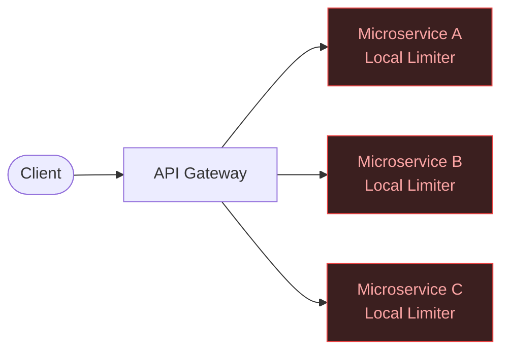

**Problem:** No global coordination. User sends requests to multiple instances — each with its own counter. If each allows 100 req/min and you have 10 instances, the user effectively gets 1000 req/min. Enforcement is meaningless.

### Option 2: Global Centralized Rate Limiter

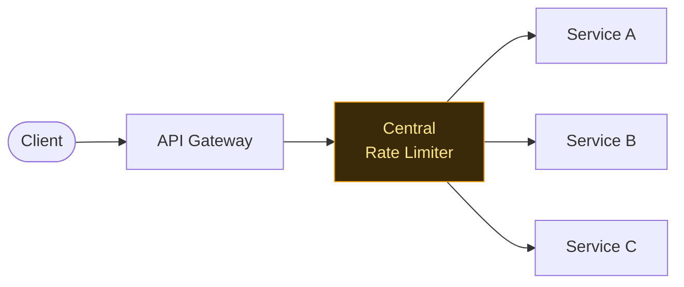

**Problem:** Additional network latency, bottleneck risk, extra infrastructure dependency. At very high scale, this becomes expensive and fragile.

### Option 3: Gateway-Level Rate Limiter ✓ (Most Common)

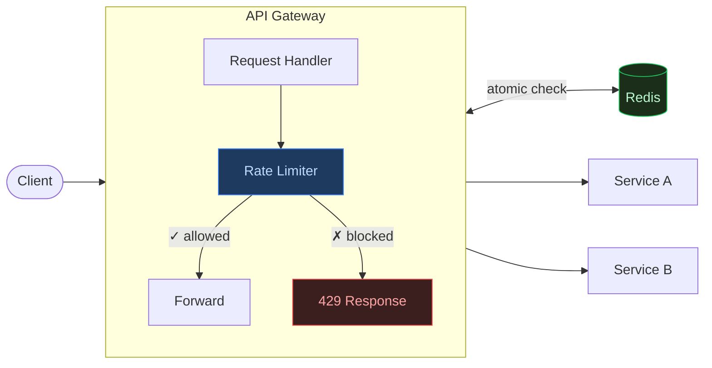

This is usually the best compromise. It blocks bad traffic early, protects downstream systems, and enforces policy centrally. The tradeoff is that the gateway may not fully understand business context (premium vs free users, dynamic roles) — solved via JWT claims or rule engines.

---

## 6. System Interface

A clean interface simplifies the entire architecture:

```text
isRequestAllowed(clientId, request)
```

Response:

```json
{
  "allowed": true,
  "remaining": 42,
  "resetTime": 1716995400
}
```

The interface should be stateless from the caller's perspective, return its decision quickly, and expose useful metadata.

---

## 7. Core Entities

### Client

```json
{
  "clientId": "user_123",
  "ip": "203.0.113.42",
  "userType": "premium",
  "apiKey": "sk_live_abc..."
}
```

### Rule

```json
{
  "userType": "premium",
  "limit": 1000,
  "window": "1 minute",
  "algorithm": "token_bucket"
}
```

---

## 8. Fixed Window Rate Limiting

The simplest algorithm. Time is divided into fixed calendar windows and a counter tracks requests within each window.

### How It Works

```
Timeline: ──────────────|──────────────|──────────────
              Window 1       Window 2       Window 3
           12:00 - 12:01  12:01 - 12:02  12:02 - 12:03
              counter=87      counter=0      counter=0
```

Each user gets a key combining their ID and the current window:

```
alice:2024-01-01-12:00 → 87   (13 remaining)
bob:2024-01-01-12:00   → 100  (BLOCKED)
```

**Request flow:**
1. Compute window key: `userId + floor(now / windowSize)`
2. Increment counter atomically: `INCR key`
3. Set TTL on first request: `EXPIRE key windowSize`
4. If counter > limit → reject with 429

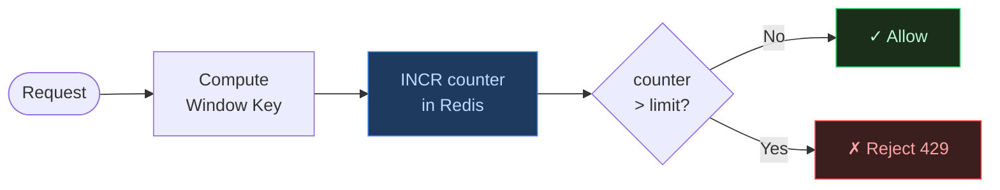

### The Boundary Burst Problem

This is the fundamental flaw. At window boundaries, a user can send **2× the limit in 2 seconds** while technically staying within rules:

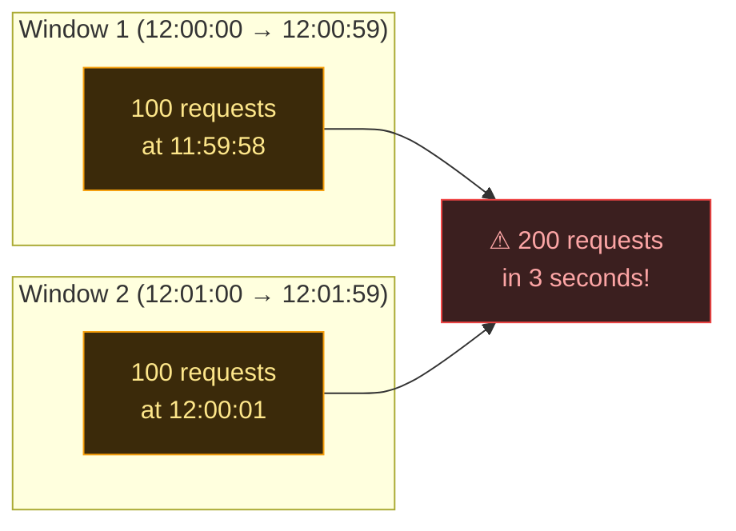

The counter resets to 0 at 12:01:00 — the system sees both bursts as valid.

### The Starvation Problem

If a user exhausts all tokens at the start of the window, they get zero capacity for the rest of it — creating "starvation periods":

```
12:00:00 → User sends 100 requests (limit reached)
12:00:02 → All subsequent requests blocked
12:01:00 → Counter resets — user can send again
           (58 seconds of forced inactivity)
```

**When to use:** Internal admin tools, low-traffic endpoints, or anywhere burst tolerance is acceptable and simplicity is paramount.

---

## 9. Sliding Window Rate Limiting

Instead of resetting at calendar boundaries, the window **slides continuously** with time. At any moment, the system counts requests in the last N seconds ending at *right now*.

### How It Works

```
Current time: 12:01:30

Fixed window sees:           Sliding window sees:
|──── 12:01 ────|            |─── last 60 sec ───|
 counter = 6                  12:00:30 → 12:01:30
 (ignores 12:00)              counts BOTH windows
```

Every request timestamp is stored in a **sorted set** (Redis ZSET):

```
ZADD user:alice 1716995490 "req1"
ZADD user:alice 1716995491 "req2"
...
```

**Request flow:**

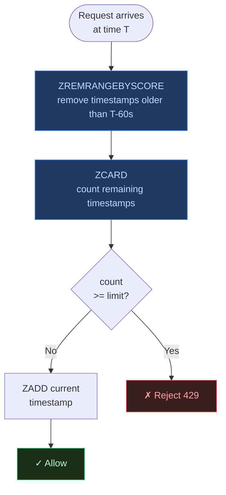

### Why It Eliminates Boundary Bursts

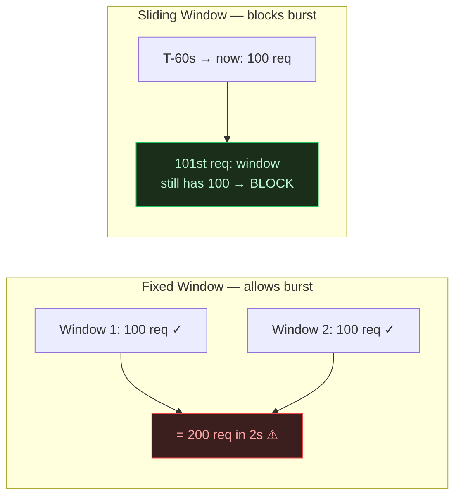

The sliding window always sees all 100 previous requests, no matter when the window boundary falls.

### The Memory Problem

Every request timestamp must be stored. With millions of users at high RPS:

```
100M users × 100 timestamps each = 10 billion entries
~50 bytes per entry = ~500 GB of Redis memory
```

This makes pure sliding window **impractical at internet scale**. Enter the sliding window counter.

---

## 10. Sliding Window Counter

A hybrid that approximates the sliding window using only **2 integers per user** — orders of magnitude cheaper than storing timestamps.

### Core Idea

Instead of exact timestamps, store just the count for the current window and the previous window. Use the elapsed fraction of the current window to weight the previous count.

```
Previous window (12:00–12:01): count_prev = 80
Current window  (12:01–12:02): count_curr = 30
Current time: 12:01:42 → 70% through current window

Overlap from previous window = 1 - 0.70 = 30%

Estimated requests in last 60s:
  = count_curr + (overlap × count_prev)
  = 30 + (0.30 × 80)
  = 30 + 24
  = 54 requests
```

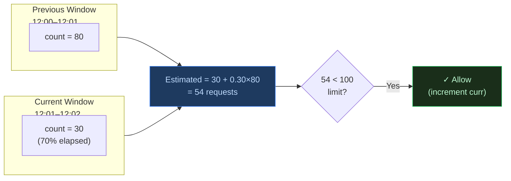

### Memory Comparison

| Algorithm | Storage per user | 100M users |
|---|---|---|
| Sliding Window (exact) | ~100 timestamps × 8 bytes | ~80 GB |
| Sliding Window Counter | 2 integers × 8 bytes | ~1.6 GB |
| Fixed Window | 1 integer × 8 bytes | ~0.8 GB |

### Accuracy Trade-off

The approximation assumes requests in the previous window were **uniformly distributed** over time. If a user front-loaded all requests at the start of the previous window, the estimate is slightly optimistic. In practice, at scale this error averages out and is acceptable for rate limiting purposes.

**Maximum error:** The algorithm can allow up to `(limit × overlap_fraction)` extra requests in the worst case — typically less than 5% overshoot.

---

## 11. Token Bucket Algorithm

The most widely deployed production algorithm. Models rate limiting as a physical bucket filling with tokens — it naturally handles both **sustained throughput** and **burst traffic** in a single elegant mechanism.

### The Mental Model

```
Bucket capacity: 100 tokens     (max burst size)
Refill rate:      10 tokens/sec  (sustained throughput)

State at any point: { tokens: N, lastRefill: timestamp }
```

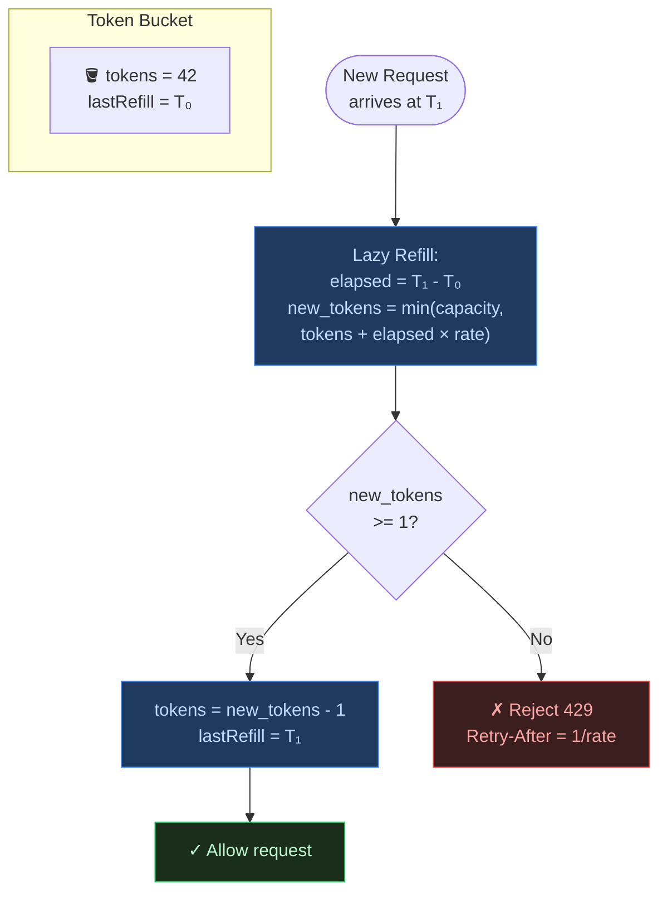

### Burst vs Sustained Rate

This is what makes token bucket uniquely powerful — it independently controls **peak burst** and **average throughput**:

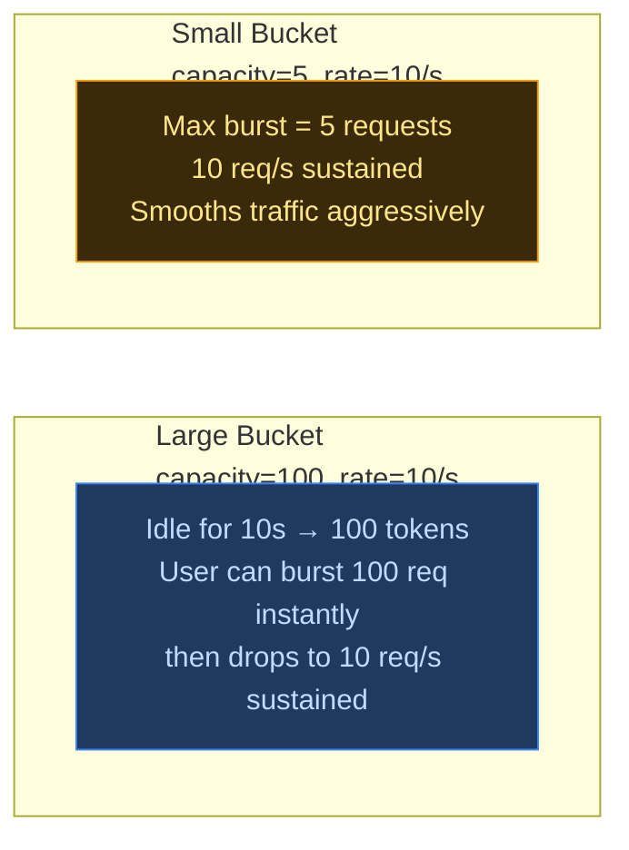

**Large bucket** — good for APIs where users occasionally need short bursts (batch uploads, report generation).

**Small bucket** — good for login endpoints, payment flows, or anywhere traffic smoothing is critical.

### Lazy Refill: The Key Optimization

**Never** run a background job to top up every bucket. With 100M users, that's 100M Redis writes per second for no reason.

Instead: **compute the refill only when a request arrives.**

```lua
-- Redis Lua script (atomic)
local now = tonumber(ARGV[1])
local capacity = tonumber(ARGV[2])
local rate = tonumber(ARGV[3])  -- tokens per ms

local data = redis.call('HMGET', KEYS[1], 'tokens', 'last_refill')
local tokens = tonumber(data[1]) or capacity
local last = tonumber(data[2]) or now

-- Refill proportional to elapsed time
local elapsed = now - last
local refill = elapsed * rate
tokens = math.min(capacity, tokens + refill)

local allowed = 0
if tokens >= 1 then
  tokens = tokens - 1
  allowed = 1
end

redis.call('HMSET', KEYS[1], 'tokens', tokens, 'last_refill', now)
redis.call('PEXPIRE', KEYS[1], 3600000)  -- 1 hour TTL
return { allowed, math.floor(tokens) }
```

Inactive users cost zero CPU. Tokens accumulate naturally during idle periods. The bucket just tracks two numbers and the math runs on-demand.

### Per-User State

```json
{
  "tokens": 42.7,
  "lastRefill": 1716995490123
}
```

That's the entire state for one user — two fields, ~16 bytes. At 100M users:

```
100M × 16 bytes = 1.6 GB (+ Redis overhead ~150 bytes/key = ~15 GB total)
```

### Comparison with Fixed Window

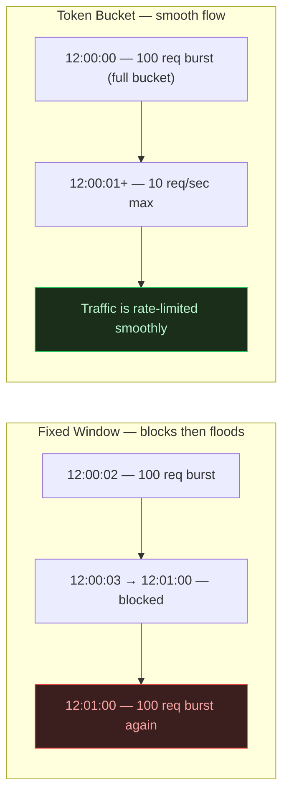

**When to use:** Token bucket is the default choice for most production systems. Use it unless you have a specific reason to prefer one of the others.

---

## 12. The Shared State Problem

At production scale, multiple gateways exist:

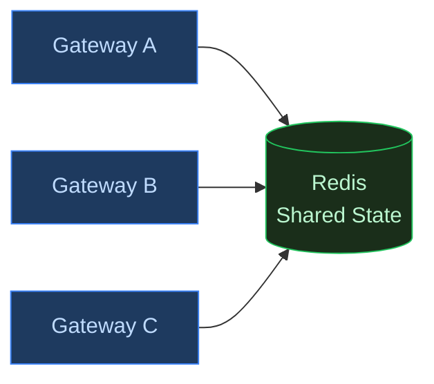

If each gateway keeps local counters, limits become inconsistent and users bypass enforcement. State must be **shared and atomic**.

---

## 13. Why Redis

Redis is the default choice for rate limiters because:

- **In-memory speed** — sub-millisecond operations
- **Atomic operations** — Lua scripts and EVAL
- **Data structures** — Hashes, Sorted Sets, Strings
- **Replication** — Primary/replica HA
- **Cluster** — Horizontal sharding built-in
- **TTL** — Automatic cleanup of stale keys

---

## 14. Production Architecture


---

## 15. Race Conditions: Where Junior Designs Fail

Suppose two gateways process requests simultaneously:

```
Gateway A reads: tokens = 1  →  allows request
Gateway B reads: tokens = 1  →  allows request

Two requests consumed one token. Limit violated.
```

This is the **lost update problem**. At high traffic, limits become meaningless.

### The Fix: Atomic Operations

Read + modify + write must happen **atomically**. Redis Lua scripts guarantee this:

> Redis executes Lua scripts using a single-threaded model. Only one Lua script runs at a time per node. The entire operation is atomic.

Instead of three separate commands:

```
HGET key tokens       ← read
(calculate locally)   ← modify
HSET key tokens new   ← write
```

Everything executes as **one atomic unit** via `EVAL`:

```lua
local key = KEYS[1]
local capacity = tonumber(ARGV[1])
local refill_rate = tonumber(ARGV[2])
local now = tonumber(ARGV[3])
local requested = tonumber(ARGV[4])

local data = redis.call('HMGET', key, 'tokens', 'last_refill')
local tokens = tonumber(data[1]) or capacity
local last_refill = tonumber(data[2]) or now

-- Lazy refill: only compute when request arrives
local elapsed = math.max(0, now - last_refill)
local refilled = elapsed * refill_rate / 1000
tokens = math.min(capacity, tokens + refilled)

local allowed = 0
if tokens >= requested then
  tokens = tokens - requested
  allowed = 1
end

redis.call('HMSET', key, 'tokens', tokens, 'last_refill', now)
redis.call('EXPIRE', key, 3600)  -- TTL cleanup

return { allowed, math.floor(tokens) }
```

No race condition possible. One request wins. Others queue at the Redis level, not in application memory.

---

## 16. Lazy Refill: A Critical Optimization

**Never** run a background scheduler to refill buckets continuously.

Bad idea:

```
Dedicated thread refills every user's bucket every second
```

With 100 million users, most are inactive. A scheduler updating every bucket would:
- Waste CPU on idle users
- Generate millions of useless Redis writes
- Destroy throughput

**Correct approach: Lazy refill on request arrival.**

```lua
local elapsed = now - last_refill
local refilled = elapsed * refill_rate / 1000
tokens = math.min(capacity, tokens + refilled)
```

Only compute when a request arrives. Massive optimization.

---

## 17. Fail Fast Philosophy

A rate limiter should **never queue requests**. Queuing is catastrophic:

| Behavior | Effect |
|---|---|
| Queue rejected requests | Memory pressure → OOM |
| Wait for token availability | Tail latency explosion |
| Hold connections | Thread pool exhaustion |

Correct behavior:

```
Token available? → Allow
No token?        → Return 429 immediately
```

Fast failure protects the system. The client retries with `Retry-After`.

---

## 18. Redis Throughput Bottleneck

Redis is fast — but not infinitely fast. A single node running Lua scripts at 1M RPS will saturate.

### Latency Breakdown (Realistic)

| Component | Latency |
|---|---|
| Network to Redis | 0.5 ms |
| Lua script execution | 0.2 ms |
| Return trip | 0.5 ms |
| **Total** | **~1.2 ms** |

At internet scale, even 1 ms matters.

---

## 19. Redis Sharding with Consistent Hashing

Distribute users across multiple Redis nodes:


Redis Cluster internally uses **16,384 hash slots** to map keys to nodes automatically. Gateways use the cluster client — they don't need to know which node holds which user.

---

## 20. High Availability

What happens when Redis fails?

### Fail Open

If the limiter is unavailable → **allow traffic**.

| | |
|---|---|
| ✓ | Product stays accessible |
| ✗ | Abuse protection temporarily lost |

### Fail Closed

If the limiter is unavailable → **reject all traffic**.

| | |
|---|---|
| ✓ | Strong protection maintained |
| ✗ | Service outage for all users |

**Most systems choose fail-open** for availability. A brief window of unprotected traffic is almost always preferable to a full outage.

### Redis Replication

Each shard has replicas. Replication is asynchronous:

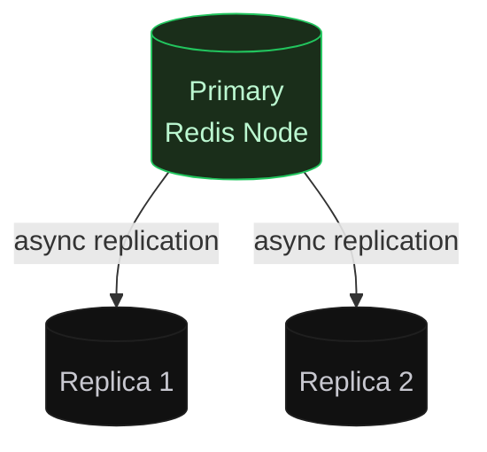

Tradeoff: some counters may lag briefly → **Availability > Consistency**.

---

## 21. Connection Pooling

Opening a new TCP connection for every Redis call is catastrophic:

- TCP handshake overhead on every request
- Latency spikes
- File descriptor exhaustion

**Solution:** Maintain a persistent connection pool. Gateways reuse existing connections. Pool sizes still require careful tuning based on RPS and concurrency.

---

## 22. Geographic Distribution

A user in India should not depend on a Redis node in the US. Production systems deploy:


**Goal: Keep the rate limiter co-located with the traffic it serves.**

---

## 23. Dynamic Rule Management

Business rules change constantly. Bad approach:

```
Gateway polls rules database every 30 seconds
```

Problems: slow propagation, unnecessary DB load, 30-second stale windows.

**Better: Push-based updates**

Use ZooKeeper, Kafka, or a dedicated config service. Gateways subscribe to rule changes. When rules change:

```
Config Service → publishes event → All gateways update in-memory rules
```

Propagation happens in milliseconds, not seconds.

---

## 24. Real-World Challenges

### Clock Synchronization

Distributed systems have clock drift. Time-based algorithms become inaccurate. Use NTP synchronization and always generate timestamps **server-side** at the gateway, not client-side.

### Hot Keys

Large enterprise customers or bots can generate enormous traffic. A single Redis key:

```
rate_limit:enterprise_customer_A → 500K RPS on one shard
```

That shard's CPU spikes, latency grows, and the problem spreads to co-located keys.

**Mitigations:**

1. **Key splitting** — `user:123:0`, `user:123:1`, `user:123:2` (distribute load, aggregate for decisions)
2. **Local buffering** — Gateway reserves token batches from Redis (precision vs scalability tradeoff)
3. **Custom infrastructure** — Large enterprise clients sometimes get dedicated rate limit infrastructure

### Multi-Region Consistency

Global rate limits across regions are genuinely hard. Strict consistency requires cross-region coordination — adding 50–200 ms latency per request. Most companies intentionally accept approximate enforcement. The engineering decision is **what error margin is acceptable**, not how to achieve perfection.

---

## 25. The Token Bucket Deep Dive: Mathematical Model

Suppose:

```
Bucket Capacity = 100 tokens
Refill Rate     = 10 tokens/sec
```

At `t0 = 1000 ms`, user has `tokens = 40`.

Request arrives at `t1 = 4000 ms`:

```
elapsed   = 4000 - 1000 = 3000 ms = 3 sec
refill    = 3 × 10 = 30 tokens
new total = min(100, 40 + 30) = 70 tokens
after req = 70 - 1 = 69 tokens
```

This seems trivial. The devil is in the implementation.

### Precision Problem

Suppose refill rate is 3 tokens/sec and requests arrive every 100 ms:

```
Per request: 0.3 token generated
Integer math: 0 added  ← wrong!
```

Over time, users are unfairly throttled and capacity is wasted. **Real systems use floating point or fixed-point arithmetic:**

```lua
-- Store as milliTokens for precision
local tokens_milli = tonumber(data[1]) or (capacity * 1000)
local refill_milli = elapsed * refill_rate  -- no division error
```

---

## 26. Local Cache Optimization

To reduce Redis pressure, gateways can maintain a **local token cache**:

Instead of asking Redis for every request, the gateway reserves batches:

```
Gateway reserves 100 tokens from Redis
Serves locally until exhausted
Then refreshes from Redis
```

### Why This Is Dangerous

3 gateways × 100 reserved tokens = **300 burst requests possible** before Redis is consulted. This is a precision vs scalability tradeoff. Acceptable error margin depends on business context.

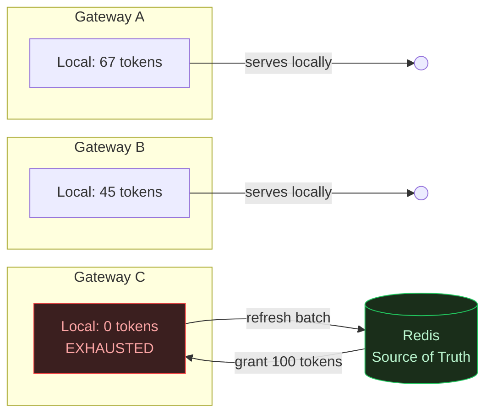

---

## 27. Memory Cost Estimation

```
100 million active users
~150 bytes per user (key + tokens + timestamp + Redis overhead)

Total: ~15 GB just for rate limit state
       × 2 for replication = ~30 GB
```

Real infrastructure cost is significant. TTL-based cleanup is essential — inactive users should expire after 1–2 hours of inactivity.

---

## 28. Failure Scenarios and Mitigations

### Scenario: Redis Latency Spike

```
Redis latency: 1 ms → 40 ms  (suddenly)
```

Consequences:
1. Gateway threads blocked waiting for Redis
2. Request queues build up
3. Tail latency explodes across all services
4. Cascading failures begin

**Mitigations:**

| Mitigation | What It Does |
|---|---|
| Timeouts | Never wait forever for Redis — set 5–10 ms deadline |
| Circuit Breaker | Temporarily bypass limiter if Redis is unhealthy |
| Fail Open | Fall back to allow-all mode |
| Load Shedding | Drop low-priority traffic first |

---

## 29. Complete Distributed Architecture

Everything covered so far — gateways, Redis shards, replicas, config service, connection pools — wired together as a single production system:


Key properties of this architecture:
- **Load balancer** distributes traffic evenly across 3 gateway nodes
- **Each gateway** maintains a local connection pool to Redis and a local rule cache — no cold lookups per request
- **Config service** pushes rule changes to all gateways in real-time via pub/sub — no polling
- **4 Redis primaries** hold disjoint hash slot ranges — horizontal partition of all user state
- **Each primary has 2 replicas** — if a primary fails, a replica promotes automatically
- **Gateways route atomically** — each Lua script EVAL goes to exactly one shard based on the user key hash, no cross-shard coordination needed
- **Downstream services** only see allowed traffic — all 429 rejections happen at the gateway layer

---

## 30. Algorithm Comparison

| Algorithm | Accuracy | Memory | Complexity | Burst Handling |
|---|---|---|---|---|
| Fixed Window | Low | Very Low | Very Easy | Poor |
| Sliding Window | High | High | Medium | Good |
| Sliding Counter | Medium | Low | Medium | Better |
| Token Bucket | High | Low | Medium | Excellent |

**For most production systems: Token Bucket wins.** High accuracy, low memory, excellent burst handling, and the lazy-refill trick makes it computationally efficient.

---

## 30. Observability

A production rate limiter without observability is amateur engineering. Monitor:

- Allowed requests/sec (per user tier, per endpoint)
- Rejected requests/sec (with rejection reasons)
- Redis operation latency (p50, p95, p99)
- Lua script execution time
- Hot key detection (top-N by request volume)
- Redis memory usage per shard
- Shard imbalance metrics
- Connection pool saturation
- Circuit breaker state transitions

Without this, you discover failures only after the outage.

---

## 31. Recommended Production Stack

For most modern distributed systems at scale:

| Component | Choice | Why |
|---|---|---|
| Placement | API Gateway | Early rejection, centralized policy |
| Algorithm | Token Bucket | Burst handling + memory efficiency |
| Shared State | Redis Cluster | Speed, atomicity, sharding built-in |
| Atomicity | Lua scripts (EVAL) | Eliminates race conditions |
| HA | Primary + replicas | Fail open on partition |
| Scaling | Consistent hashing | Even distribution, rebalancing |
| Cleanup | TTL on all keys | Memory bounded automatically |
| Rules | Push-based config | Millisecond propagation |
| Monitoring | Prometheus + Grafana | Latency, rejection rates, hot keys |

---

## 32. What Separates Beginner from Senior System Design

**Beginner answer:**

> Use Redis. Use token bucket. Done.

**Senior-level thinking:**

- What happens during Redis latency spikes?
- How do we detect and handle hot shards?
- What consistency guarantees exist between regions?
- How does multi-region enforcement work?
- What are the failure modes — and which do we fail open vs closed?
- How is observability handled?
- How are rules updated without redeployment?
- What are the memory and network costs at 100M users?
- What happens during failover?
- What inaccuracies are acceptable given the cost?

The difference is not knowing concepts — it's understanding **what happens when things go wrong** and having principled answers to tradeoffs.

---

## 33. Interview Questions

### Basic

1. What is rate limiting and why is it important?
2. What is the difference between throttling and rate limiting?
3. Why is the fixed window algorithm fundamentally flawed?

### Intermediate

1. Why is Redis the common choice for distributed rate limiting?
2. How do you avoid race conditions in a distributed counter?
3. Why use Lua scripts instead of individual Redis commands?
4. How does the token bucket algorithm handle burst traffic?
5. Why place the limiter at the gateway rather than in each service?

### Advanced

1. How would you scale a rate limiter to 10M RPS?
2. How would you handle global limits across multiple regions?
3. What happens if Redis crashes — fail open or fail closed? How do you implement each?
4. How do you detect and mitigate hot key problems?
5. How would you design dynamic rule propagation with millisecond latency?
6. What are the memory cost implications at 100 million users?

---

## Final Thoughts

Rate limiting is not just about blocking requests. It is a distributed systems engineering problem involving scalability, fault tolerance, concurrency, data consistency, latency optimization, and traffic fairness.

Most beginner designs fail because they ignore race conditions, distributed coordination, failure handling, and scaling bottlenecks.

A strong rate limiter must fail fast, scale horizontally, minimize latency, remain highly available, handle bursts gracefully, and avoid centralized bottlenecks.

> **If you truly understand rate limiter design deeply, you understand a significant portion of distributed systems fundamentals — and that matters far beyond just rate limiting.**
